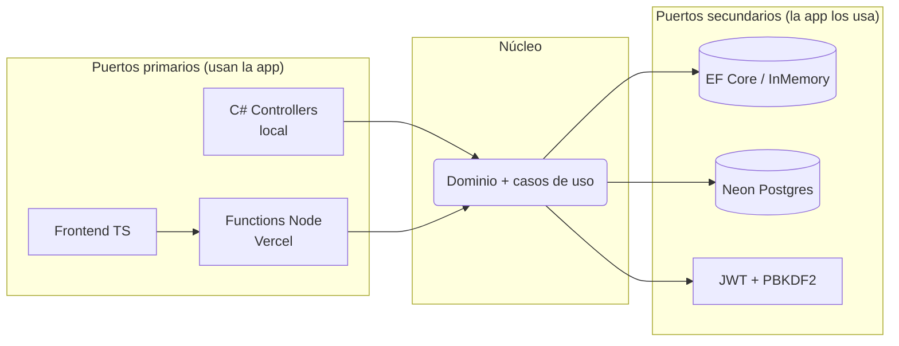
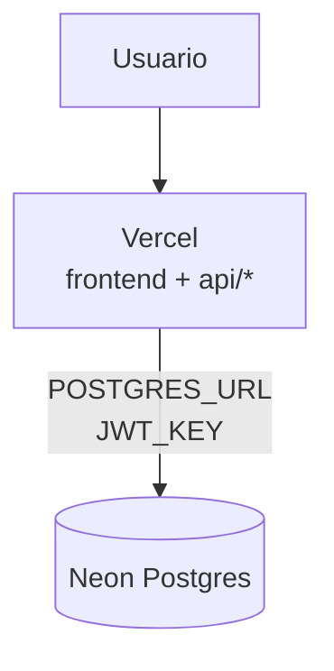

<div align="center">

# 🎮 DigitalGaming

**Tienda gamer dominicana — consolas, videojuegos, PC, monitores y accesorios.**

[](https://dotnet.microsoft.com/)
[](https://www.typescriptlang.org/)
[](https://nodejs.org/)
[](https://neon.tech/)
[](https://vercel.com/)

Precios en **RD$** · Envíos a todo el país · Preventa GTA VI con countdown

</div>

---

## ✨ Qué hace

- 🛍️ Catálogo paginado (offset/limit) con caché CDN, filtros y **búsqueda tolerante** (perdona tildes: `audifono` → *Audífono*)
- 🛒 Carrito con **stock en vivo**, zonas de envío (SD / Interior / recoger) y checkout con login
- 🔐 Auth con JWT corto (15 min) + **refresh tokens rotativos**, rate limiting y logout en todos lados
- 📦 Historial de compras + confirmación por **WhatsApp**
- 🛠️ Modo admin oculto (10 toques al título): crear/editar/eliminar, productos ocultos, upload de imágenes a Storage
- 🎬 Anuncio de preventa **GTA VI** con cuenta regresiva al 19-nov-2026

## 🧱 Stack

| Capa | Tecnología |
|---|---|
| Frontend | HTML + CSS por capas (`@layer`) + TypeScript compilado con `tsc` |
| API producción | Vercel Functions Node + TS (`pg`, `jsonwebtoken`, `@vercel/blob`, `formidable`) |
| API local/dev | ASP.NET Core 10 + C# (mismos contratos) |
| Datos | Neon Postgres (EF Core + migraciones) o memoria en local |
| Imágenes | Vercel Blob (base64 local como fallback) |
| Deploy | Vercel (frontend + functions). El C# **no** se despliega: es laboratorio local |

## 🏛️ Arquitectura

**Capas estrictas** en los 3 lenguajes (`Core → Application → Infrastructure → Api`, `domain → data → services → ui`, `base → layout → components → pages → themes`) y **hexagonal ligera**: el dominio no conoce ni EF ni `pg`; los repositorios son adaptadores intercambiables por variable de entorno.





## 📁 Estructura (qué es cada cosa)

```
├── api/                  🚀 PRODUCCIÓN — Functions Node+TS (Vercel). Lo único que corre en la nube.
├── wwwroot/              🖥️ Frontend compartido (lo sirven Vercel y el C# local).
│   ├── ts/               Fuente real (se compila con tsc, no se edita el js a mano)
│   └── js/               Generado (ignorado en git, salvo config.js)
├── db/                   schema.sql + seed.sql para Neon (SQL Editor)
├── server-dotnet/        🧪 LOCAL — API C# para desarrollar/probar (dotnet run).
│                         NO se despliega. Genera las migraciones (dotnet-ef).
├── scripts/              build de Vercel (genera js/config.js desde API_URL)
├── vercel.json           Deploy estático + headers inmutables
└── package.json          Deps Node + scripts npm
```

> **Regla de oro**: `api/` = producción real · `server-dotnet/` = laboratorio local. Mismas rutas, mismas reglas.

## 🚀 Inicio rápido (local)

Requisitos: [.NET 10 SDK](https://dotnet.microsoft.com/download) y [Node 22+](https://nodejs.org/).

```powershell
# 1. Frontend (una vez, o npx tsc --watch mientras desarrollas)
npm install
npm run build

# 2. API + tienda (datos en memoria)
dotnet run --project server-dotnet/DigitalGaming.csproj
# → http://localhost:5127
```

- Cuenta demo: `admin` / `Admin1234` · Admin: 10 toques al título.
- Con `ConnectionStrings__DefaultConnection` usa Postgres en vez de memoria.

## ☁️ Deploy (Vercel + Neon)

1. Neon → SQL Editor → corre `db/schema.sql` y `db/seed.sql`.
2. Vercel → importa el repo con env vars:

| Variable | Valor |
|---|---|
| `POSTGRES_URL` | pooled string de Neon (`?sslmode=require`) |
| `JWT_KEY` | clave de 64+ caracteres (nueva, no la de dev) |
| `API_URL` | *(vacío = mismo origen)* |
| Blob | pestaña Storage → crea un Blob store y conéctalo |

3. Deploy. Verifica `/api/products` y crea una cuenta.

## 🧪 Verificación

```powershell
npm run typecheck        # tsc web + api, estricto
node --import tsx/esm <test>.mjs   # harnesses (requiere npm install)
dotnet build server-dotnet/DigitalGaming.csproj
```

## 🗺️ Roadmap

- [ ] Roles (`admin` real en escrituras)
- [ ] Pagos (Azul/CardNet) + estados de orden
- [ ] Tests en el repo (xUnit + Playwright)
- [ ] Galería multi-imagen, wishlist, cupones
- [ ] SEO + sitemap + PWA
